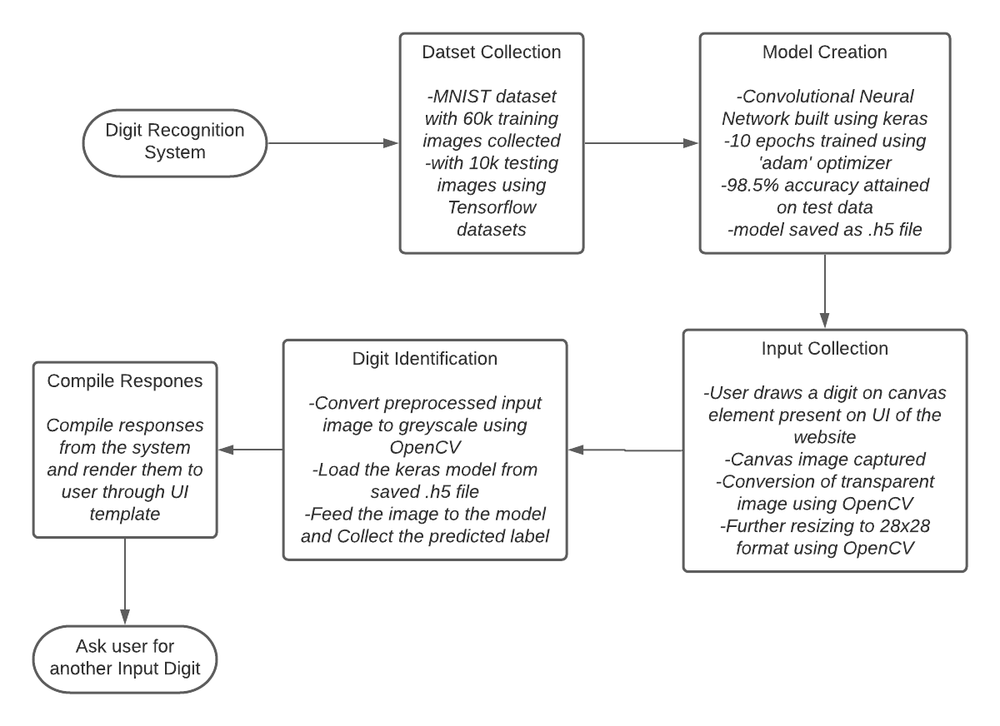
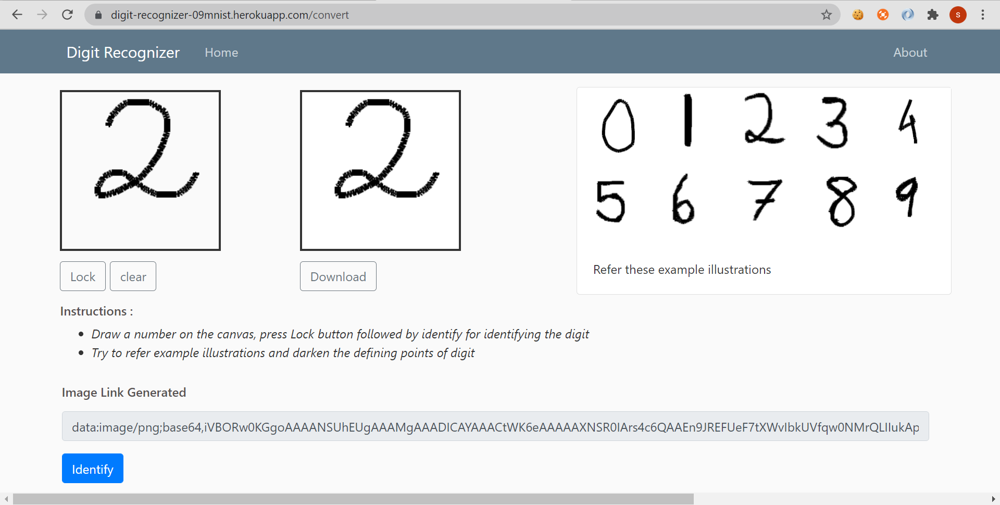
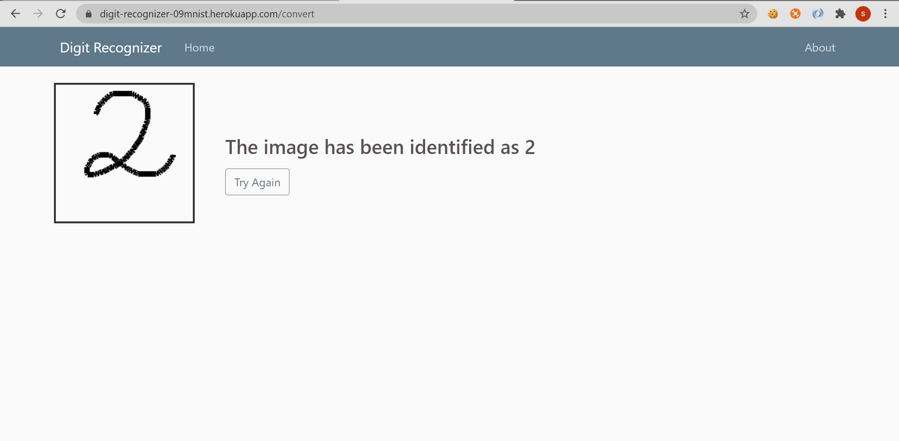

# 0-9 Digit Recognizer
This webpage illustrates the application of Image Processing and Neural Networks.
The user has to draw a number as an input to the application and the apllication returns the closest digit it resembles. 
The web application has been deployed using heroku and is available at  
https://digit-recognizer-09mnist.herokuapp.com/
## Description
The project basically aims to provide a MNIST dataset digit recognizer. 
Text preprocessing of the input canvas image has been done using OpenCV Library. 
Convolutional neural network has been used as the predicting model built using tf-keras library. 
And 'MNIST' dataset has been used as training dataset for the CNN. 
## Usage
<ul>
<li>After visiting the home page user has to press the the link to visit the convert page</li>
<li>At the convert page the user can then draw an input image on the input canvas</li>
<li>User is then required to 'Lock' the input and further press 'Identify'</li>
<li>Application will return then return the predicted output label by the model</li>
</ul>

## Flowchart Of Methodology

 
 
## I/O screenshots
### Input

 

### Output

## Authors
Suryansh Bhardwaj

## License
[MIT](https://choosealicense.com/licenses/mit/)

